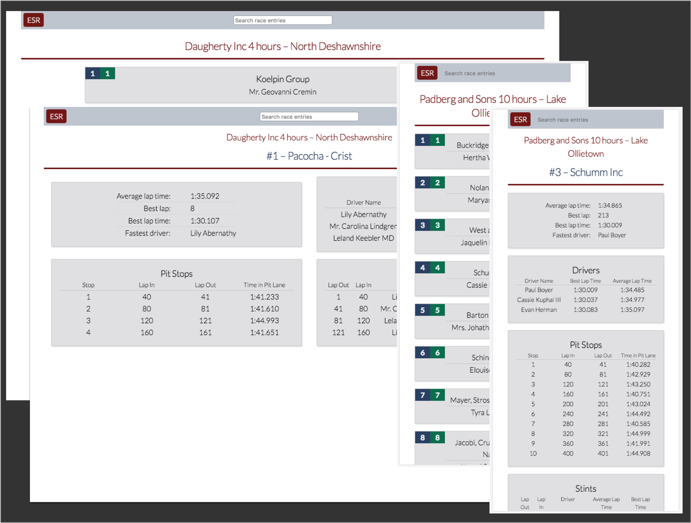
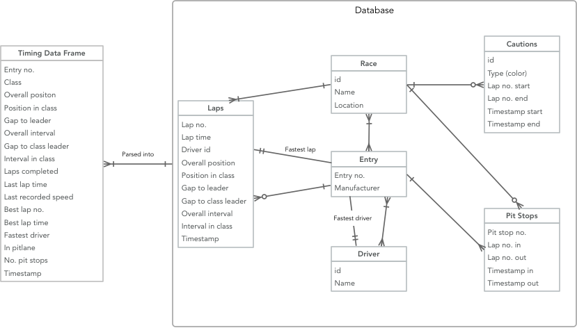

# Endurance Strategy Reporter

Endurance Strategy Reporter brings detailed post-race analysis straight to your
fingertips.



## Try it out
[Demo version](https://endurance-strategy.herokuapp.com/)

## Motivation
ESR helps fans who find the strategy of an endurance sportscar race equally (if
not more) fascinating than the whee-to-wheel action on track. While most race
series provide live timing services, they are not available after a race. ESR
allows users to browse through previous races and see critical strategy
information such as pit stop times, fuel & tire stints, along with average and best lap times.

## Features

- Browse previous races
- Search for the team, driver or car number you're interested in
- Statistics for each entry
  - Fastest driver
  - Best laps per driver
  - Pit stop times
  - Stint lengths with average and best laps per stint

## Future work
The eventual goal of this project is to connect to a live-timing service and
provide real-time analysis of a race-in-progress. Additionally, improving the
quality of the statistics provided (including adding lap charts) are left for
future iterations, along with giving users the ability to compare multiple
entries against one another.

## Questions? Problems?
If you encounter problems with ESR, don't hesitate to [raise an
issue](https://github.com/aseehra/endurance-strategy/issues/new).

## Technologies
### Frontend
- React
- Redux
- React Router
- Jest & Enzyme

### Backend
See [server repository](https://github.com/aseehra/endurance-strategy-server)
for details.
- Express
- Knex.js
- PostgreSQL
- Jest & SuperTest
- Node.js

## Key components
### Frontend
- [`EnduranceStrategy`](https://github.com/aseehra/endurance-strategy/blob/master/src/containers/EnduranceStrategy/EnduranceStrategy.jsx):
  the top level application component. It is responsible for driving the rest of
  the application, and hosts the BrowserRouter.
- [`EntryDetails.jsx`](https://github.com/aseehra/endurance-strategy/blob/master/src/containers/EntryDetails/EntryDetails.jsx):
  drives the display of a race entry's statistics.
- [`StintData.jsx`](https://github.com/aseehra/endurance-strategy/blob/master/src/containers/StintData/StintData.jsx):
  fetches and formats stint data for display.
- [`EntryList.jsx`]():
  deserializes query strings, filters entries based on search criteria, and
  fetches race entries from the API.
- [`FilterSearch.jsx`](https://github.com/aseehra/endurance-strategy/blob/master/src/containers/FilterSearch/FilterSearch.jsx):
  responsible for updating the search filter in the redux store. It will also
  force a redirect if the user hits `<Enter>`.

### Backend
- [`entries.js`](https://github.com/aseehra/endurance-strategy-server/blob/master/src/db/entries.js)
  is where the statistical analyses are calculated. This includes deriving stint
  data from stored pit-stop information.
- Data model:
  

### Installation
#### Requirements
- [Endurance Strategy Reporter API server](https://github.com/aseehra/endurance-strategy-server)
- Node.js

#### Instructions

```bash
$ yarn install
$ yarn build
$ REACT_APP_API_BASE_URL=<URL for your backend instance> serve -s build
```

#### Heroku

This project uses React Create App, and as such you should use the
[create-react-app-buildpack](https://github.com/mars/create-react-app-buildpack):

- For a new heroku app:
```bash
$ heroku create <APP NAME> --buildpack mars/create-react-app
```
- For an existing app:
```bash
$ heroku buildpacks:set mars/create-react-app
```
